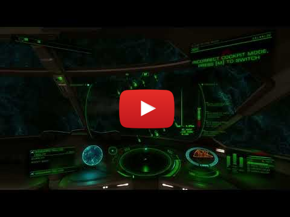

# COVAS: NEXT (E:D AI Integration)

[Getting Started](https://ratherrude.github.io/Elite-Dangerous-AI-Integration/)
|
[Join our Discord](https://discord.gg/9c58jxVuAT)
|
[Download latest version](https://github.com/RatherRude/Elite-Dangerous-AI-Integration/releases)


[](https://www.youtube.com/watch?v=nvuCwwixvxw)

This integration aims to provide a more intuitive and hands-free experience for commanders, making interactions with the game more seamless and efficient by allowing you to connect Elite:Dangerous with various services for Speech-to-Text, Text-to-Speech and Large Language Models. This creates a continuous conversation between you and the starship's computer via spoken word, as it should be in the 34th century.

The AI will react to game events, it will react to given commands not just in text but by emulating key presses or game actions. It can decide to take a screenshot or fetch information from Galnet or various APIs about topics, systems and their respective factions and stations.

The integration is designed for every commander: it's amazing at roleplaying, can replace third-party websites, can press buttons on command or if necessary provide tutorials and will always assist commanders no matter their role or level of experience.

## VR Overlay Support

COVAS:NEXT now includes native VR overlay support, allowing the assistant to appear directly in your VR headset without requiring third-party tools like OVRToolkit.

### Features
- **Native OpenVR Integration** - Direct overlay rendering in SteamVR-compatible headsets
- **Adjustable Positioning** - Control X, Y, Z position and overlay width via sliders
- **Persistent Settings** - Position preferences saved across sessions
- **Dual Display** - Overlay remains visible on monitor for streaming while also appearing in VR
- **Real-time Updates** - Position changes apply immediately

### Requirements
- **SteamVR** - Must be installed and running
- **OpenVR-compatible VR headset** - Tested with Bigscreen Beyond, should work with any SteamVR headset
- **Windows** - VR overlay currently Windows-only

### Usage
1. Launch COVAS:NEXT
2. Go to Settings → General → VR Overlay
3. Enable "Enable VR Overlay" toggle
4. Adjust position sliders:
   - **X Position**: Left/Right (-2.0 to 2.0)
   - **Y Position**: Up/Down (0.0 to 3.0) 
   - **Z Position**: Forward/Back (-3.0 to 0.0)
   - **Width**: Panel size in meters (0.5 to 3.0)
5. Open the overlay/chat window
6. Put on your VR headset - the overlay should appear at your configured position

**Recommended starting position:**
- X: 0.5, Y: 1.2, Z: -1.5, Width: 1.0

### Building from Source

#### Prerequisites
- **Visual Studio 2022** with C++ desktop development workload
- **CMake** 3.20 or higher
- **OpenVR SDK** (automatically downloaded by CMake)
- **Node.js** and **Python** (for COVAS build)

#### Build Steps

1. **Install dependencies:**
   ```bash
   npm run install:all
   ```

2. **Build VR Overlay (C++ component):**
   ```bash
   cd vr-overlay-sharedmem
   mkdir build
   cd build
   cmake .. -G "Visual Studio 17 2022" -A x64
   cmake --build . --config Release
   copy Release\CovasVROverlay.exe ..\..\vr-companion\
   cd ..\..
   ```

3. **Build Shared Memory Addon (Node.js native module):**
   ```bash
   cd shared-memory-addon
   npm install
   cd ..
   ```

4. **Build COVAS application:**
   ```bash
   npm run build        # Builds Python backend and UI
   npm run package:dir  # Creates portable version in dist/win-unpacked/
   ```

#### Development Workflow

When making changes to the VR overlay C++ code:
```bash
cd vr-overlay-sharedmem\build
cmake --build . --config Release
copy Release\CovasVROverlay.exe ..\..\vr-companion\
```

Then restart COVAS to test changes.

### Troubleshooting

**"Buffer too large" errors:**
- The overlay window may be too large for your monitor
- Try moving the overlay to a smaller monitor (1920x1080)
- The VR overlay supports up to 4K (3840x2160) resolution

**Overlay appears on floor in VR:**
- Adjust the Y position slider upward (try 1.2-1.5)
- Adjust Z position closer (try -1.5 to -2.0)

**VR overlay doesn't appear:**
- Ensure SteamVR is running before launching COVAS
- Check that "Enable VR Overlay" is toggled on in settings
- Try closing and reopening the overlay/chat window

**Position changes don't apply:**
- Position updates require closing and reopening the overlay/chat window
- Settings are saved automatically when changed

### Technical Details

The VR overlay system consists of:
- **CovasVROverlay.exe** - Standalone C++ application using OpenVR SDK
- **Shared Memory IPC** - 30fps frame capture from Electron to VR overlay
- **VROverlayService** - Electron service managing the VR process and frame capture
- **VR Settings UI** - Angular component for position control

Architecture: Electron captures the overlay window at 30fps, writes RGBA pixel data to shared memory (32-byte header + pixel buffer), and the VR overlay app reads from shared memory to display in the headset using Direct3D11 textures.
