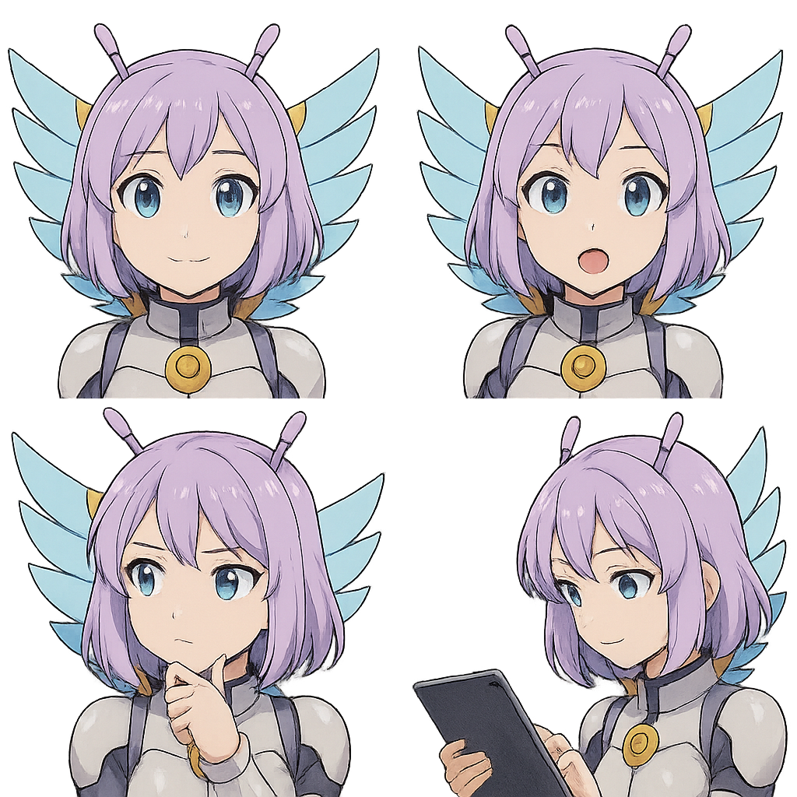

# First Steps

If you have not already done so, you should first complete the [Getting Started](./index.md) guide. This guide will help you set up your AI and get you started with the basics.

Once you have completed the setup, you can start using the AI in-game. The AI can help you with a variety of tasks, such as navigating the galaxy map, managing your ship's systems, and providing information about the game world. The AI can also assist you in combat, mining, trading, and other activities.

There are several configuration options, that you can adjust to customize the AI to your liking.

## Character Prompt

The AI Character Prompt is a description of the AI's personality. You can modify this text to your liking – if you want the AI to talk about your ships cat, you can mention "We have a cat on our ship that likes to get in the way of my controls when it wants attention.", causing the AI to role-play and mention the cats current whereabouts regularly. More examples can be found on our discord server.

## Audio

The integration uses your microphone for speech recognition. We support voice activation and push-to-talk (PTT). When using voice activation, we recommend using headphones to avoid the AI hearing itself, which causes a feedback loop.

## Event Triggers

Changes in the game world can trigger events that the AI can respond to. For example, when the ship is in danger, the AI can be programmed to inform you. These reactions are configured in the UI in the **Reactions** tab of the settings, where you can choose to silence some events or have the AI respond to others, making the AI more or less chatty.

For a more in-depth guide on reactions and event triggers, see the [Reactions](./25_reactions.md) page.

## Keyboard Bindings

Certain keyboard bindings are required for the AI to trigger game actions. In the **Actions** tab of the settings, the UI will inform you if actions are unassigned, conflicting, or unsupported. Actions can be toggled on and off to disable unwanted ones, such as ejecting all cargo.

For a full list of actions and their required keyboard buttons, see the [Actions](./20_actions.md) page.

## Avatars

Avatars allow you to give the AI a face. You provide a 2×2 grid with equal sections; each section shows the same styled character in one of four attitudes:

|  | **Top-left:** the character is listening **Top-right:** the character is speaking **Bottom-left:** the character is thinking **Bottom-right:** the character is performing searches or actions |
|----------------------------------------------------------------|------------------------------------------------------------------------------------------------------------------------------------------------------------------------------------------------------|

## Upgrading the AI

You will automatically receive a notification when a new version of the AI is available during the launch of the application. After downloading the new version, you can extract the files into a new folder and run the new version. To keep you configuration settings, you can copy the `config.json` file from the old folder to the new folder. To keep your previous conversations, you can copy the `covas.db` file from the old foldere to the new folder.
