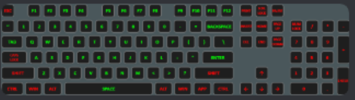

# Keybindings

At the time of writing, COVAS:NEXT only has support for the following Elite: Dangerous keybindings:

## Usage with HOTAS or other controllers

A common workaround is to assign keyboard bindings alongside your controller bindings, even if you don't use a keyboard. This allows COVAS:NEXT to use these keybindings for its commands, while you continue to use your controller for the game.

## Secondary Keybindings

TODO: check how secondary keybindings can be used