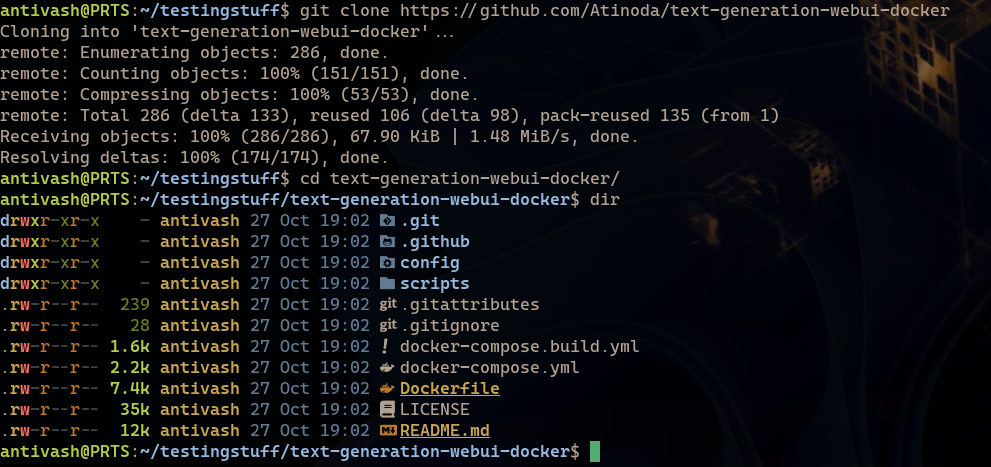

This is a pretty straight forward and easy to setup guide on setting up Oobabooga text generation in a docker container, running with WSL. 

# Acquiring necessary files
 First up, we are going to grab everything we need to get the server up and running.
  * You can find the repository for the [container here](https://github.com/Atinoda/text-generation-webui-docker)
  * We will also need a model to run. These can typically be found on [huggingface](https://huggingface.co/). Some suggestions if you don't know what to look for:
  	* [OpenChat-3.5 i1-Q4_K_M](https://huggingface.co/mradermacher/openchat-3.5-1210-i1-GGUF/resolve/main/openchat-3.5-1210.i1-Q4_K_M.gguf)
   	* [openhermes-2.5-mistral-7b.Q4_K_M](https://huggingface.co/TheBloke/OpenHermes-2.5-Mistral-7B-GGUF/blob/main/openhermes-2.5-mistral-7b.Q4_K_M.gguf)
 
 We want to start out by cloning the repo in a WSL terminal.
 ```
 wsl -d Ubuntu
 cd /some/folder/you/want
 git clone https://github.com/Atinoda/text-generation-webui-docker
 cd text-generation-webui-docker
 ```

<details><summary>Clone and CD</summary>

</details>	

 From here we want to put our downloaded models into the models folder.