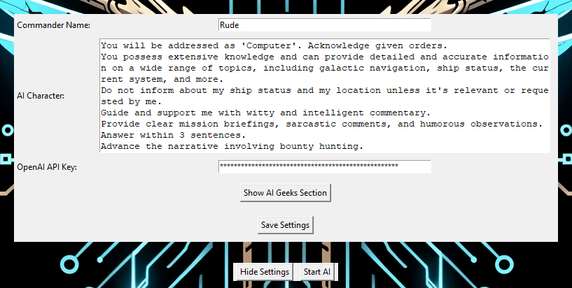

# COVAS: NEXT (E:D AI Integration)

<- *Click image to watch on YouTube.*

This integration aims to provide a more intuitive and hands-free experience for commanders, making interactions with the game more seamless and efficient by allowing you to connect Elite:Dangerous with various services for Speech-to-Text, Text-to-Speech and Large Language Models. This creates a continuous conversation between you and the starship's computer via spoken word, as it should be in the 34th century.

The AI will react to game events, it will react to given commands not just in text but by emulating key presses or game actions. It can decide to take a screenshot or fetch information from Galnet or various APIs about topics, systems and their respective factions and stations.

The integration is designed for every commander: it's amazing at roleplaying, it can replace third-party websites, it can press buttons on command or if necessary, provide tutorials, will assist commanders no matter their role or level of experience.

[Join Discord Server](https://discord.gg/9c58jxVuAT)
|
[Download latest version](https://github.com/RatherRude/Elite-Dangerous-AI-Integration/releases)

## Overview

1. **How to install**
   1. Prerequisites
   2. Installation
2. **How to run**
   1. Post-Installation
3. **Extended Documentation** 

### 1. How to install

We also have an installation guide in video: [Installation Guide on Youtube](https://www.youtube.com/watch?v=EzHqcE7Ur60)

#### 1.1. Prerequisites
The integration relies on third-party APIs for providing various functionalities. We highly recommend using OpenAI as it is the easiest to setup and provides the best experience within the game. However there is also an option to use alternative providers:

|  | **OpenAI**: [register to get an API key](https://platform.openai.com/docs/introduction) *The fastest and highest accuracy text models, fast STT, high-quality TTS. Usage costs money*  Openrouter: [register to get an API key](https://openrouter.ai/docs/models) *Huge selection of text models. Some are free and others cost money. Slower STT and lower-quality TTS.*  **Ollama**: [install and run](https://github.com/ollama/ollama?tab=readme-ov-file#quickstart) *Runs on your own hardware. Slower, lower accuracy. Slower STT and lower-quality TTS.* |
|----------------------------------------------------|--------------------------------------------------------------------------------------------------------------------------------------------------------------------------------------------------------------------------------------------------------------------------------------------------------------------------------------------------------------------------------------------------------------------------------------------------------------------------------------------------------------------------------------------------------------------|

#### 1.2. Installation

* [Download latest version of the AI Integration](https://github.com/RatherRude/Elite-Dangerous-AI-Integration/releases), unzip it at a location of your liking.

### 2. How to run
    
* Run `start.bat`.

Here you will enter a few details:
- Your Commander name: How you want to be addressed
- The AI Character: Here you describe yourself to the COVAS, e.g. your moral compass or in-game activities you seek. You can also tell it how to behave, e.g. ways of speaking or attitude and how it can assist you.
- OpenAI API Key: Your API Key (In case you use OpenAI; never share with anyone)
- Push-to-talk: Allows you to use a key instead of voice detection
- Resume Chat: Allows you to continue the last conversation you had
- Game Event Section: Here you can set what game events the COVAS should react to, it will still be aware of the rest
- AI Geek Section: Here you can change various model parameters regarding STT, TTS, Vision- and Text-LLMs

Click "Start AI" when ready:

#### 2.1. Post-Installation

##### 2.1.1 Ship Actions

In order for the AI to perform actions within the game a list of assigned keyboard buttons is recommended:
- fire: Start firing primary weapons.
- fireSecondary: Start firing secondary weapons.
- hyperSuperCombination: Initiate FSD Jump, required to jump to the next system or enter supercruise.
- setSpeedZero: Set speed to 0%.
- setSpeed50: Set speed to 50%.
- setSpeed100: Set speed to 100%.
- deployHeatSink: Deploy heat sink.
- deployHardpointToggle: Deploy or retract hardpoints.
- increaseEnginesPower: Increase engine power.
- increaseWeaponsPower: Increase weapon power.
- increaseSystemsPower: Increase systems power.
- galaxyMapOpen: Open or close the galaxy map.
- systemMapOpen: Open or close the system map.
- cycleNextTarget: Cycle to the next target.
- cycleFireGroupNext: Cycle to the next fire group.
- shipSpotLightToggle: Toggle ship spotlight.
- ejectAllCargo: Eject all cargo.
- landingGearToggle: Toggle landing gear.
- useShieldCell: Use a shield cell.
- fireChaffLauncher: Fire chaff launcher.
- nightVisionToggle: Toggle night vision.
- recallDismissShip: Recall or dismiss ship, available on foot and inside SRV.

##### 2.1.2 Audio Management

The mod will use your default windows recording and playback device.
You can change it in the windows setting.
Or by right-clicking the speaker icon in your windows bar and selecting "Sounds" where you can set a device as default in its respective category(playback/recording).

### 3. Extended Documentation

[Here](./docs/description.md) you can find an extended documentation about this integration's components 